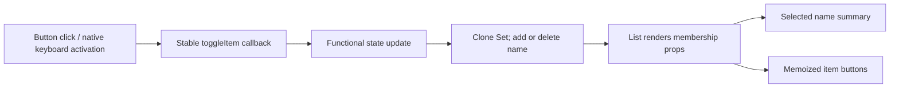

# Frontend selection exercise: technical manual

## Scope and learning goals

This is an interview exercise solution, not a commercial product or reconstructed proprietary prompt. The application displays generated fruit/size/color items, allows independent multi-selection, lists selected names, and exposes selection to keyboard and assistive-technology users. Its small scope makes state identity, event behavior, rendering, and accessibility easy to inspect.

A **component** is a React function that returns interface elements. **State** is data React retains between renders. A **Set** stores unique values and supports membership checks. **Memoization** lets React reuse a component's rendered result when its props have not changed; it is an optimization, not a correctness guarantee.

Read [app.jsx](../app.jsx) from `ListItem` through `List`. The generated data and root mounting code below the existing protected marker remain unchanged. There is no backend, database schema, login, persistence, payment flow, or secret configuration. Selection lives only in the current browser page and resets on reload.

## Setup and a feature walkthrough

The no-build demo uses pinned React 18.2.0, ReactDOM 18.2.0, and Babel standalone 7.25.6 CDN scripts from [index.html](../index.html). Babel translates JSX into JavaScript in the browser. A network connection is required for that mode.

Serve from the repository root:

```sh
python3 -m http.server 0 --bind 127.0.0.1
```

Open the localhost URL at the free port printed by the server. Do not rely on opening `index.html` with `file://`: Babel fetches the separate JSX file, and browser origin rules can block that request. Stop the server with Ctrl-C.

1. Observe “Selected items: None.”
2. Click “tiny navy apple.” Its selected outline appears and its name appears in the summary.
3. Tab to “tiny blue apple” and press Space. Both names are shown; selection is independent.
4. Press Enter on the same button. That item is deselected while the first remains selected.
5. Deselect the first item and observe “None” again.
6. Select a few items and reload. The state resets intentionally.

The data is the Cartesian product of five sizes, ten fruits, and sixteen colors: 800 items. A Cartesian product means every combination appears. The generated name uniquely identifies each item for this dataset; a real domain with repeated names would need a separate stable ID.

## Source map and contracts

| Path | Purpose |
| --- | --- |
| [app.jsx](../app.jsx) | Memoized item button, selection state, generated items, root mount |
| [styles.css](../styles.css) | Original colorful responsive tile grid, selection/focus styling, readable label colors |
| [index.html](../index.html) | Root element and pinned no-build runtime loading |
| [package.json](../package.json), [package-lock.json](../package-lock.json) | Exact development dependencies and deterministic installs |
| [tests/server.mjs](../tests/server.mjs) | Loopback test server on a free port; local equivalents of CDN dependencies |
| [tests/selection.spec.mjs](../tests/selection.spec.mjs) | Browser behavior and narrow-viewport checks |
| [playwright.config.mjs](../playwright.config.mjs) | Chromium test configuration and optional local executable path |
| [.github/workflows/ci.yml](../.github/workflows/ci.yml) | Node 22 installation and Chromium checks |

An item has `{ name: string, color: string }`. `List` accepts an `items` array. `ListItem` accepts an item reference, `isSelected` boolean, and `onToggle(name)` function. The component contract assumes stable unique names and known color class names. There is no JSON network API.



`selectedNames` is initialized lazily with `useState(() => new Set())`. The toggle callback uses `useCallback` with an empty dependency list and updates state through the functional updater. This receives React's current state rather than closing over an outdated render. It creates a new Set, then adds/removes the clicked name. Mutating the old Set in place and returning the same object can prevent React from recognizing a change.

`Array.from(selectedNames)` preserves insertion order. Deselecting and reselecting an item puts it at the end of the summary. The summary is therefore selection order, not alphabetical or original grid order.

## Rendering and accessibility decisions

`ListItem` is wrapped with `React.memo`. When one item changes, the parent still loops over all 800 entries and computes membership. Unchanged item references, the stable callback, and unchanged booleans let React skip many child renders. This is not virtualization: all 800 controls remain in the DOM. Passing a new item object or callback to every child would reduce the optimization's benefit.

Each tile is a native `button type="button"` inside a list item. That preserves `ul`/`li` list semantics and delegates Enter/Space activation to the browser. The former custom keydown emulation is unnecessary. The native disabled/default form behaviors are familiar, though there is no form here.

`aria-pressed` exposes toggle state. The selected outline conveys state beyond color. `:focus-visible` supplies a visible keyboard focus indicator. The summary uses `aria-live="polite"`, requesting announcement without interrupting current speech. Very large selections can create verbose announcements; that remains a tradeoff in this small exercise.

The grid retains its sixteen-color identity. Dark labels are used on bright backgrounds while dark tiles retain white labels. Text can wrap inside each 60-pixel row, preventing long generated names from depending on one-line overflow. At a 320-pixel viewport, browser tests verify no document-wide horizontal overflow. This is useful regression evidence, not a comprehensive accessibility certification across assistive technologies.

## Reproducible tests

Use Node 22 (the CI baseline) and npm:

```sh
npm ci
npx playwright install chromium
npm test
npm audit
```

For an already installed Chromium-compatible executable, set `CHROMIUM_PATH` to its absolute path before `npm test`. CI installs Playwright's own Chromium. The test server chooses an ephemeral port, binds to 127.0.0.1, and is terminated after the suite. It serves a small explicit allowlist of files, not arbitrary filesystem paths.

The test server substitutes the exact same pinned React/Babel versions from `node_modules` into the HTML response. This makes behavior tests independent of CDN availability; it does **not** verify that a user's network can reach the CDN. The checked-in demo entrypoint remains CDN-based.

The suite asserts 800 buttons and 800 list items, initial empty summary, multiple selections, native Space/Enter behavior, `aria-pressed`, selected classes, deselection, absence of page JavaScript errors, narrow-screen overflow, and reload reset. There is no separate transpilation build, linter, or type-checker configured. The test browser performs JSX translation through Babel just as the demo does.

## Failure labs and diagnosis

- **Blank page over `file://`:** inspect the console/network panel for JSX fetch/origin errors, then use the local HTTP server. Expected: the fetched `app.jsx` renders the grid.
- **Blocked CDN:** disconnect network in the no-build mode. Expected: React/Babel may not load and no usable grid appears. Restore access or run deterministic local tests; do not claim the CDN demo works offline.
- **Lost rerenders:** on a scratch copy, replace `new Set(current)` with `current`. Observe unreliable visual updates caused by preserving state identity. Solution: restore immutable copying.
- **Stale updates:** on a scratch copy, use a callback that closes over the first `selectedNames` render. Multiple toggles can lose prior choices. Solution: retain the functional updater.
- **Selection after reload:** no selected names should survive. There is no localStorage/sessionStorage contract; reset is expected.
- **Memoization experiment:** use React DevTools Profiler to inspect a toggle before/after creating new item objects per render. Correct selection can still work while render counts increase. Do not infer performance improvement without measurement.

Debug in this order: runtime scripts loaded, JSX fetched successfully, root element found, button event fired, Set membership changed, and class/ARIA state rendered. A browser warning about development Babel is expected for this deliberately no-build exercise; it is not a production bundling recommendation.

## Extension exercises and solutions

**Add Clear selection above the protected marker.** Use a button that sets a new empty Set. Disable it when size is zero and test that all tiles lose `aria-pressed=true`. Solution must preserve the generated data below the marker and not mutate the Set.

**Add name filtering.** Derive visible items from a text query while retaining the full selected-name Set. Decide whether hidden selections stay selected; a useful solution keeps them and describes that policy in the summary. Test selecting, filtering the item out, and clearing the filter without losing selection.

**Use stable IDs for duplicate labels.** Update component props/state to key on an ID supplied by a new exercise dataset, with a separate label map for display. Solution must not use array index as identity when reordering is possible. For this repository, leave protected generated data intact and demonstrate the design in an isolated test/example.

**Scale beyond 800 controls.** Measure interaction cost before introducing virtualization. A solution must preserve keyboard focus when rows mount/unmount and explain how a screen reader discovers the total set. Memoization alone does not reduce DOM size.

## Interview questions with answers

- **Why a Set?** Selection is a uniqueness/membership problem. Set add/delete/has expresses that directly without duplicates.
- **Why clone it?** React compares state identity; mutation of the old object can hide changes and makes previous renders' state unreliable.
- **Why a functional state updater?** It uses the latest queued state and keeps an empty-dependency callback safe.
- **What does memo skip?** Child rendering when shallowly compared props are unchanged; it does not skip the parent's map or remove DOM nodes.
- **Why a native button?** Browser keyboard and accessibility semantics are more robust than recreating activation on a generic element.
- **What would you change for a production UI?** Define stable domain IDs, accessible large-list behavior, persistence requirements, bundling, and measured performance. Those are follow-on decisions, not claims about this interview exercise.
